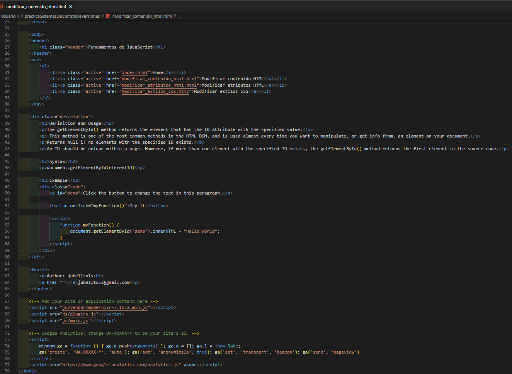
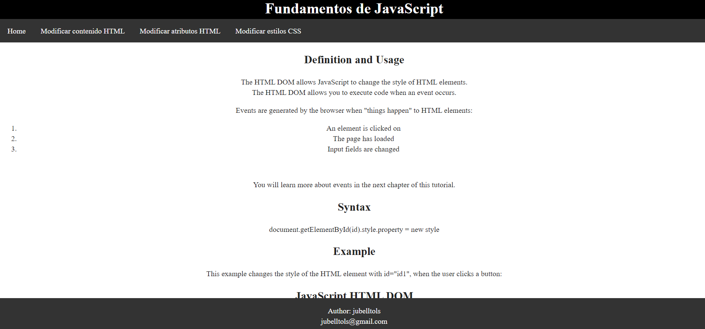

# Sistemas de control de versiones

## 1. ¿Qué es git?
Git es un sistema de control de versiones.
Un sistema de control de versiones nos va a servir para trabajar en equipo de una manera mucho más simple y optima cuando estamos desarrollando software.
Con Git vamos a poder controlar todos los cambios que se hacen en nuestra aplicación y en nuestro código y vamos a tener control absoluto de todo lo que pasa en el código, pudiendo volver atrás en el tiempo, pudiendo abrir diferentes ramas de desarrollo, etc.
Vamos a poder trabajar en equipo de una manera muy sencilla y optimizada, de forma que si tenemos dos o tres personas trabajando en ciertas funcionalidades del proyecto y nosotros podemos estar trabajando en nuestra parte del código. Cuando acabamos de desarrollar nuestro código, utilizamos Git para mezclar los cambios con los otros compañeros. De forma que el código se mezcla de manera perfecta sin generar ningún tipo de fallo y de forma rápida.
También nos va a proporcionar un listado de los cambios(commits) y podemos volver atrás en el tiempo a cualquiera de esos cambios o commits.
Además tendremos la posibilidad de trabajar con ramas de desarrollo, que nos van a permitir desarrollar cosas que divergen mucho del programa principal.

## 2. La metodología utilizada para el desarrollo de la web
Git flow, que como su nombre indica, es un flujo de trabajo aplicado a un repositorio Git. Vincent Driessen fue el encargado de popularizarlo, definiendo un modelo estricto de ramificación diseñado en torno a los lanzamientos del proyecto. Es ideal para proyectos que lleven una planificación de entregas iterativas. Permite la paralelización del desarrollo mediante ramas independientes para la preparación, mantenimiento y publicación de versiones del proyecto así como soporta la reparación de errores en cualquier momento.

## 2.1. Ramas principales
### 2.1.1. Rama master
Contiene cada una de las versiones estables del proyecto. Cualquier commit que subamos en esta rama debe estar preparado para que se pueda incluir en producción.

### 2.1.2. Rama develop
Contiene el código de desarrollo de la siguiente versión planificada del proyecto. En ella se incluirán cada una de las nuevas características que se desarrollen. Esta rama puede incorporarse tanto en una rama release (que veremos más adelante) como en la rama master, para su despliegue en producción.

## 2.2. Ramas de apoyo
### 2.2.1. Ramas feature
Estas ramas tienen que surgir de la rama develop. Cada una de estas ramas almacenan código de desarrollo con nuevas características. Típicamente existen solamente en los repositorios locales de los desarrolladores y no en el repositorio origen. Una vez terminado su desarrollo, se incorporarán nuevamente a la rama develop, que contendrá la última versión de código en desarrollo.

### 2.2.2. Ramas release
Como las ramas feature, las ramas release también tienen que surgir de la rama develop. Contienen el código de la versión que se va a liberar próximamente. Es un paso previo y preparatorio para la versión definitiva de producción. En ella se incluye todo el código de develop necesario para el lanzamiento. Puede que contenga algún error pequeño que se debe de arreglar en este momento para no incluirlo en producción. Una vez finalizada la rama, esta se debe incluir tanto en la rama develop como en la rama master.

### 2.2.3. Ramas hotfix
Estas ramas surgen de la rama master. Contienen una versión de producción con un error que se desea arreglar urgentemente. Una vez arreglado el error, se incluye el contenido de esta rama en las ramas master y develop para subsanar el error. Además, hay que marcar la versión arreglada de producción con un tag en la rama master.

## 3. Explicacion de la practica 
Nuestro equipo de programadores está compuesto por 3 personas. Por este motivo, hemos decidido dividir el trabajo de la siguiente forma:
- El usuario 1 que es el más experimentado, se encargará de crear el repositorio del proyecto e implementará la estructura inicial del proyecto utilizando un boilerplate. Esta página inicial incluirá la cabecera, la barra de navegación con el acceso a Home y el footer de la página. En la parte central del home incluirá una breve descripción del curso.
- El usuario 2 creará la sección de “Modificar contenido HTML” en el que incluirá algún ejemplo así como una explicación de dicho código. También desarrollará la sección “Modificar atributos HTML
- El usuario 3 que acaba de llegar a la empresa implementará la sección “Modificar estilos CSS” de la misma forma que ha hecho el usuario 2. Añadirá ejemplos.
Así pues, nuestra tarea consistirá en crear un repositorio en Github en el que simulemos toda la implementación acordada además de documentar todo el proceso correctamente para que nuestro cliente vea que somos una empresa seria y trabajamos siguiendo una metodología. 

## 4. Usuario 1
### 4.1. Creacion del repositorio Github


### 4.2. Implementacion de la estructura inicial del proyecto utilizando un [Boilerplate](https://github.com/h5bp/html5-boilerplate)
```
npx create-html5-boilerplate practicaSistemasDeControlDeVersiones
```
```
cd practicaSistemasDeControlDeVersiones
```
```
npm install
```

```
git init
```
```
git add .
```

```
git commit -m "Estructura inicial"  
```


### 4.3. Primer push al repositorio remoto
```
git branch -M main
```
```
git remote add origin https://github.com/jubelltols/practicaSistemasDeControlDeVersiones.git
```
```
git push -u origin main
```


### 4.4. Adecuacion de la estructura inicial para la metodología Git Flow
```
git flow init
```
```
git branch
```
```
git push -u origin develop
```
.png)

### 4.5. Creacion de la pagina inicial

```
git add .
```
```
git commit -m "MOTIVO DEL COMMIT: Creacion de la pagina inicial IMPLEMENTACIÓN: Creacion del header, nav, descripcion y footer"  
```
```
git push
```


## 5. Usuario 2
### 5.1. Clonacion del repositorio 
```
git clone https://github.com/jubelltols/practicaSistemasDeControlDeVersiones.git
```
```
cd practicaSistemasDeControlDeVersiones
```
```
git flow init 
```


### 5.2. Creacion de la features contenidoHTML
```
git flow feature start contenidoHTML
```

### 5.3. Creacion de la seccion modificar contenido HTML


```
git add .
```
```
git commit -m "MOTIVO DEL COMMIT: Creacion seccion: Modificar contenido HTML IMPLEMENTACIÓN: creacion de la pagina: modificar contenido HTML con una pequeña explicaion y un ejemplo"
```

```
git flow feature publish contenidoHTML
```
.png)
```
git flow feature finish contenidoHTML
```
```
git push origin --all
```

### 5.4. Creacion de la features atributosHTML
```
git flow feature start atributosHTML
```

### 5.5. Creacion de la seccion modificar atributos HTML


```
git add .
```
```
git commit -m "MOTIVO DEL COMMIT: Creacion seccion: Modificar atributos HTML IMPLEMENTACIÓN: creacion de la pagina: modificar atributos HTML con una pequeña explicaion y un ejemplo"
```

```
git flow feature publish feature/atributosHTML
```

```
git flow feature finish atributosHTML
```
```
git push origin --all
```

## 6. Usuario 3
### 6.1. Clonacion del repositorio
```
git clone https://github.com/jubelltols/practicaSistemasDeControlDeVersiones.git
```
```
cd practicaSistemasDeControlDeVersiones
```
```
git flow init 
``` 

### 6.2. Creacion de la features estilosCSS
```
git flow feature start estilosCSS
```

### 6.3. Creacion de la seccion modificar estilos CSS


```
git add .
```
```
git commit -m "MOTIVO DEL COMMIT: Creacion seccion: Modificar estilos CSS IMPLEMENTACIÓN: creacion de la pagina: modificar estilos CSS con una pequeña explicaion y un ejemplo"
```
```
git flow feature publish estilosCSS
```

```
git flow feature finish estilosCSS
```
```
git push origin --all
```


## 7. Usuario 1
### 7.1. Fusion de todas las ramas
```
git pull 
```

```
git checkout main
```
```
git merge --no-ff develop
```
```
git push origin main
```

### 7.2. Etiquetar a la version 1 (v1.0) por el usuario 1
```
git tag v1.0
```
```
git push origin v1.0
```

### 7.3. Creacion de la rama test por el usuario 1
```
git checkout -b test v1.0
```
```
git push origin test
```

## 8. Git Hook: 
### 8.1. Automatización de la instalación del proyecto

### 8.2. Verificación del formato de mensaje de commit.

### 8.3. Check caracteres extraños

### 8.4. Verificar formato correcto ficheros html
Con el siguiente commando instalaremos eslint html
```
npm install --save-dev eslint @html-eslint/parser @html-eslint/eslint-plugin
```
Añadiremos al fichero .eslintrc.js el siguiente codigo


Tambien añadiremos al fichero package.json el siguiente codigo en el apartado de los scripts
```
"lint": "@eslint ."
```
Por ultimo al hook pre-commit añadiremos la linea siguiente:
```
npm run lint
```
### 8.5.Añadir hook a carpeta gitHooks y vincular carpeta 
```
mkdir gitHooks
```


Mediante la opción de configuración siguiente podemos especificar a GIT la nueva ubicación de estos hooks.
```
git config core.hooksPath gitHooks
```


